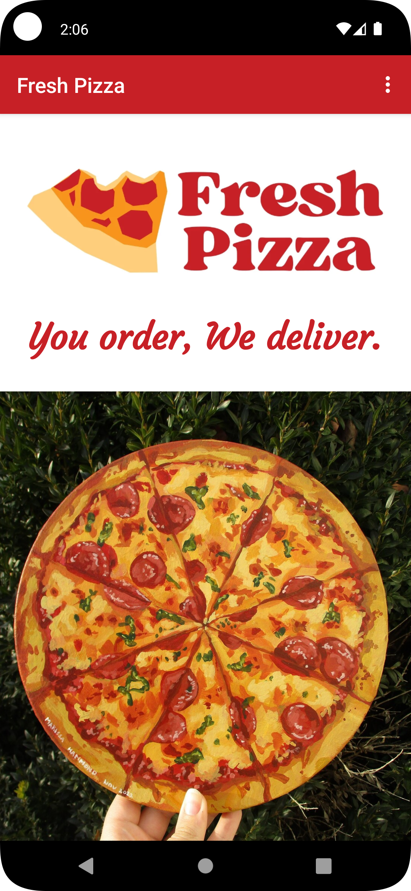
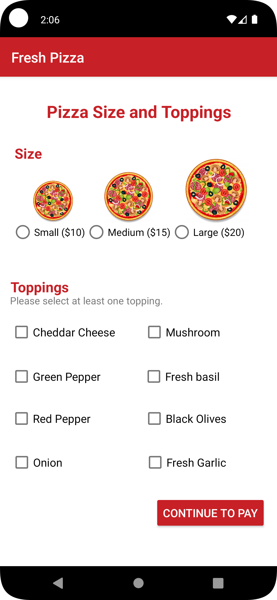
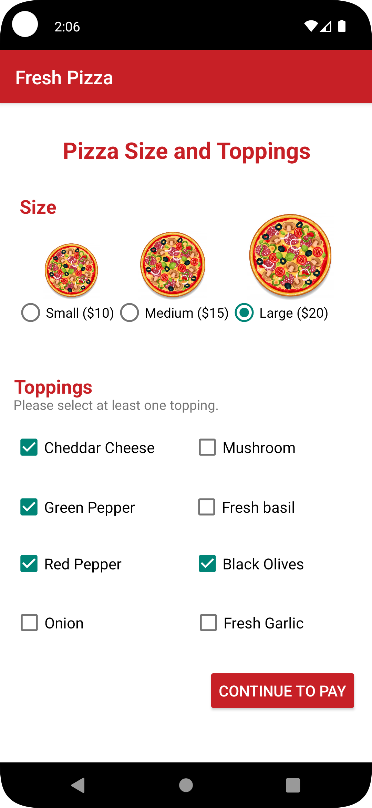
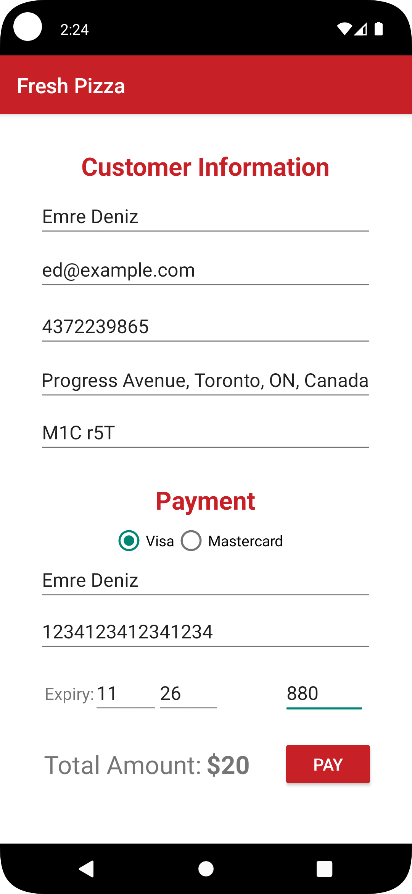
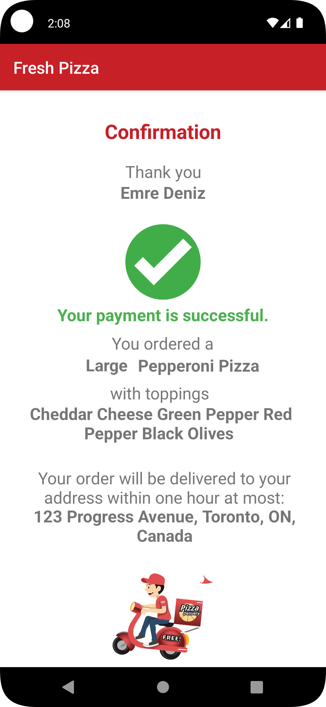

# Android-Native-Pizza-Order-App
Online pizza ordering app developed in Android Native using Kotlin and device storage

### HOW TO RUN:
```console
Open project in Android Studio
Run on Virtual or Physical Device
```

### FEATURES:
1. Select pizza type
2. Select pizza size
3. Select toppoings
4. Enter customer information
5. Enter payment information
6. Confirmation

### SCREENSHOTS:
<kbd></kbd>    <kbd></kbd>    <kbd></kbd>

<kbd></kbd>    <kbd></kbd>


